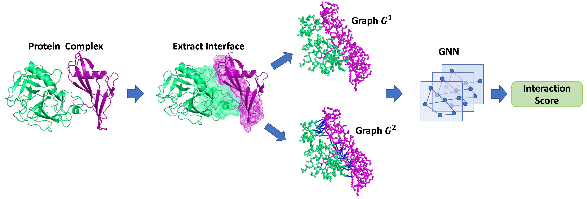
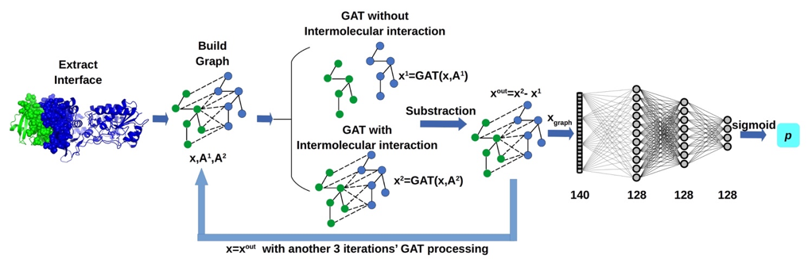
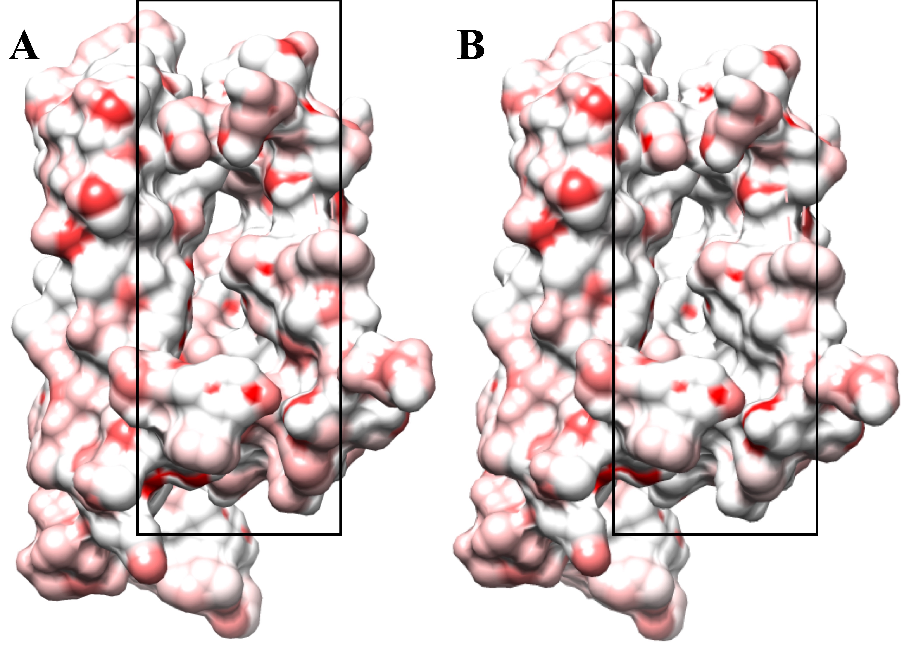

# GNN_DOVE
<a href="https://github.com/marktext/marktext/releases/latest">
   
   
   
   
   
</a>   

GNN-Dove is a computational tool using graph neural network that can evaluate the quality of docking protein-complexes.  

Copyright (C) 2020 Xiao Wang, Sean T Flannery, Daisuke Kihara, and Purdue University. 

License: GPL v3. (If you are interested in a different license, for example, for commercial use, please contact us.) 

Contact: Daisuke Kihara (dkihara@purdue.edu)


## Citation:
[Protein Docking Model Evaluation by Graph Neural Networks](https://www.frontiersin.org/articles/10.3389/fmolb.2021.647915/full)  
```
@ARTICLE{10.3389/fmolb.2021.647915,
AUTHOR={Wang, Xiao and Flannery, Sean T. and Kihara, Daisuke},   	 
TITLE={Protein Docking Model Evaluation by Graph Neural Networks},      	
JOURNAL={Frontiers in Molecular Biosciences},      	
VOLUME={8},      
PAGES={402},     	
YEAR={2021},      	  
URL={https://www.frontiersin.org/article/10.3389/fmolb.2021.647915},       
DOI={10.3389/fmolb.2021.647915},      
ISSN={2296-889X},   
}
```

## Introduction
Physical interactions of proteins play key roles in many important cellular processes. Therefore, it is crucial to determine the structure of protein complexes to understand molecular mechanisms of interactions. To complement experimental approaches, which usually take a considerable amount of time and resources, various computational methods have been developed to predict the structures of protein complexes. In computational modeling, one of the challenges is to identify near-native structures from a large pool of generated models. Here, we developed a deep learning-based approach named Graph Neural Network-based DOcking decoy eValuation scorE (GNN-DOVE). To evaluate a protein docking model, GNN-DOVE extracts the interface area and represents it as a graph. The chemical properties of atoms and the inter-atom distances are used as features of nodes and edges in the graph. GNN-DOVE was trained and validated on docking models in the Dockground database. GNN-DOVE performed better than existing methods including DOVE, which is our previous development that uses convolutional neural network on voxelized structure models.

## Overall Protocol
```
(1) Extract the interface region of protein-complex;
(2) Construct two graphs with/wihout intermolecular interactions based on interface region;
(3) Apply GNN with attention mechanism to process two input graphs;
(4) Output the evaluation score for input protein-complex.
```
<p align="center">
  
</p> 

## Network Architecture

<p align="center">
  
</p> 
The illustration of graph neural network (GNN) with attention and gate-augmented mechanism (GAT)

## Pre-required software
Python 3 : https://www.python.org/downloads/    
rdkit: https://www.rdkit.org/docs/Install.html    
chimera (optional): https://www.cgl.ucsf.edu/chimera/download.html

## Installation  
### 1. [`Install git`](https://git-scm.com/book/en/v2/Getting-Started-Installing-Git) 
### 2. Clone the repository in your computer 
```
git clone git@github.com:kiharalab/GNN_DOVE.git && cd GNN_DOVE
```

### 3. Build dependencies.   
You have two options to install dependency on your computer:
#### 3.1 Install with pip and python(Ver 3.6.9).
##### 3.1.1[`install pip`](https://pip.pypa.io/en/stable/installing/).
##### 3.1.2  Install dependency in command line.
```
pip install -r requirements.txt --user
```
If you encounter any errors, you can install each library one by one:
```
pip install torch==1.7.0
pip install numpy==1.18.1
pip install scipy==1.4.1
```

#### 3.2 Install with anaconda
##### 3.2.1 [`install conda`](https://docs.conda.io/projects/conda/en/latest/user-guide/install/macos.html). 
##### 3.2.2 Install dependency in command line
```
conda create -n GNN_DOVE python=3.6.10
conda activate GNN_DOVE
pip install -r requirements.txt 
```
Each time when you want to run my code, simply activate the environment by
```
conda activate GNN_DOVE
conda deactivate(If you want to exit) 
```

## Usage
```
python3 main.py
  -h, --help            show this help message and exit
  -F F                  decoy example path
  --mode MODE           0: evaluate for single docking model 
                        1: evaluate for multi docking models
                        2: visualize attention for w/w.o intermolecular graphs from interface region
  --gpu GPU             Choose gpu id, example: '1,2'(specify use gpu 1 and 2)
  --batch_size          batch_size
  --num_workers         number of workers
  --n_graph_layer       number of GNN layer
  --d_graph_layer       dimension of GNN layer
  --n_FC_layer          number of FC layer
  --d_FC_layer          dimension of FC layer
  --initial_mu          initial value of mu
  --initial_dev         initial value of dev
  --dropout_rate        dropout_rate
  --seed SEED           random seed for shuffling
  --fold FOLD           specify fold model for prediction

```
### 1 Evaluate single protein-complex
```
python main.py --mode=0 -F [pdb_file] --gpu=[gpu_id] --fold=[fold_model_id]
```
Here -F should specify a pdb file with Receptor chain ID 'A' and ligand chain ID 'B'; --gpu is used to specify the gpu id; --fold should specify the fold model you will use, where -1 denotes that you want to use the average prediction of 4 fold models and 1,2,3,4 will choose different model for predictions. **(Recommend)You can specify --fold=5 to use the pretrained model with a much larger benchmark (Dockground+Zdock).**
The output will be kept in [Predict_Result/Single_Target]. The prediction result will be kept in Predict.txt.    
##### Example Command (Fold 1 Model):  
```
python main.py --mode=0 -F=example/input/correct.pdb --gpu=0 --fold=1
```

### 2 Evaluate many protein-complexes
```
python main.py --mode=1 -F [pdb_dir] --gpu=[gpu_id] --fold=[fold_model_id]
```
Here -F should specify the directory that inclues pdb files with Receptor chain ID 'A' and ligand chain ID 'B'; --gpu is used to specify the gpu id; --fold should specify the fold model you will use, where -1 denotes that you want to use the average prediction of 4 fold models and 1,2,3,4 will choose different model for predictions. **(Recommend)You can specify --fold=5 to use the pretrained model with a much larger benchmark (Dockground+Zdock).**
The output will be kept in [Predict_Result/Multi_Target]. The prediction results will be kept in Predict.txt.   
##### Example Command (All Model):  
```
python main.py --mode=1 -F=example/input --gpu=0 --fold=-1
```

### 3 Evaluate with model pretrained on Dockground+Zdock benchmark （Recommend）
#### 3.1 Evaluate single protein-complex
```
python main.py --mode=0 -F [pdb_file] --gpu=[gpu_id] --fold=5
```
Here -F should specify a pdb file with Receptor chain ID 'A' and ligand chain ID 'B'; --gpu is used to specify the gpu id.
The output will be kept in [Predict_Result/Single_Target]. The prediction result will be kept in Predict.txt.    
##### Example Command:  
```
python main.py --mode=0 -F=example/input/correct.pdb --gpu=0 --fold=5
```

#### 3.2 Evaluate many protein-complexes
```
python main.py --mode=1 -F [pdb_dir] --gpu=[gpu_id] --fold=5
```
Here -F should specify the directory that inclues pdb files with Receptor chain ID 'A' and ligand chain ID 'B'; --gpu is used to specify the gpu id.
The output will be kept in [Predict_Result/Multi_Target]. The prediction results will be kept in Predict.txt.   
##### Example Command (All Model):  
```
python main.py --mode=1 -F=example/input --gpu=0 --fold=5
```


### 4 Visualize attention for interface region
```
python main.py --mode=2 -F [pdb_file] --gpu=[gpu_id] --fold=[fold_model_id]
```
Here -F should specify a pdb file with Receptor chain ID 'A' and ligand chain ID 'B'; --gpu is used to specify the gpu id; --fold should specify the fold model you will use, where 1,2,3,4 can be used to choose different model for predictions.         
The output will be kept in [Predict_Result/Visulize_Target]. The attention of graph with/without intermolecular will be saved in attention2_receptor.pdb + attention2_ligand.pdb and attention1_receptor.pdb + attention1_ligand.pdb, respectively. To visualize attention weights, please use chimera to visualize them: https://www.cgl.ucsf.edu/chimera/docs/UsersGuide/tutorials/bfactor.html. We saved the weights for each atom in the b-factor column, you can also visualize it by pymol.     

##### Example Command (Fold 1 Model):  
```
python main.py --mode=2 -F=example/input/correct.pdb --gpu=0 --fold=1
```
Here is an visualization example:

<p align="center">
  
</p> 

The left panel represents the graph with intermolecular interaction (attention2) and the right panel shows the graph only with covalent bonds (attention1).


## Example
### Input
1 Correct protein-Complex example: https://github.com/kiharalab/GNN_DOVE/blob/main/example/input/correct.pdb     
2 Incorrect protein-Complex example: https://github.com/kiharalab/GNN_DOVE/blob/main/example/input/incorrect.pdb
### Output
1 Single protein-complex output (mode=0): https://github.com/kiharalab/GNN_DOVE/tree/main/example/output/single    
2 Multi protein-complexes output (mode=1): https://github.com/kiharalab/GNN_DOVE/tree/main/example/output/multi      
3 Visualize graph attention (mode=2): https://github.com/kiharalab/GNN_DOVE/tree/main/example/output/visualize


